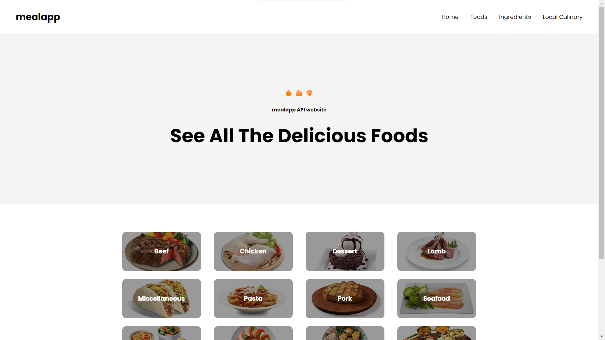

# mealapp

This website project uses the Vue.js framework version 3. Apart from that, it also uses several libraries such as:
1. Axios : fetching data from API urls
2. Vue Motion : provide animation effects on elements and components
3. Vue Router : make it easier to manage the navigation of each page


## Project Setup
### Download Project

```sh
git clone https://github.com/WahyuArd1401/cmlabs-frontend-internship-test.git
```
### Install Package

```sh
npm install
```

### Compile and Hot-Reload for Development

```sh
npm run dev
```

### Access in Browser

```sh
localhost:<your-port-in-terminal>
```

### Access Using the Deployed Url (Alternatif View)
```sh
wahyuardian-mealapp.vercel.app
```

## User Interface
### Home


### Category Detail 


### Category Detail 
